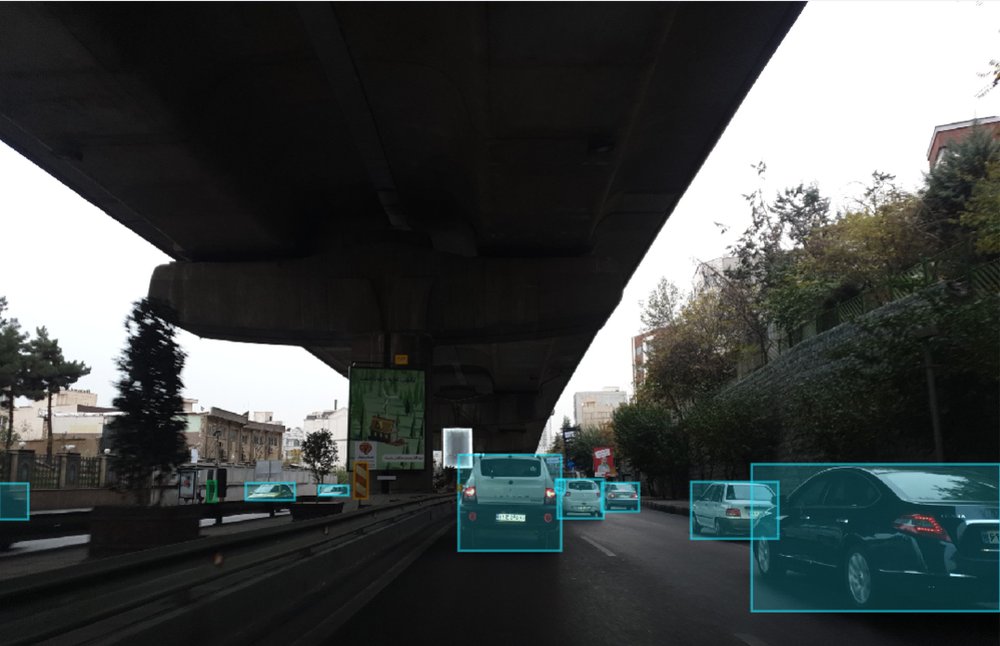

# AAIC Dataset
Dataset for 2D Object Detection in Autonomous Vehicles.  
This is the first 2D object detection dataset for self-driving cars prepared in Iran, as far as we know. AAIC Dataset will be completed gradually.
## Dataset Description
There are 1240 training images and 475 test images in the dataset, some of which will not be published until the AAIC deadline. Labels include
car, 
signal (traffic lights), 
signs (Traffic signs), 
motorcycle, 
pedestrian, 
truck, 
bus, 
and bicycle 
described in detail below.
### Labeling Specifications
With a few changes (including increasing the number of classes), we followed the [Waymo database labeling specifications](https://github.com/waymo-research/waymo-open-dataset/blob/master/docs/labeling_specifications.md).
#### Vehicle labeling instructions (cars, trucks and buses)
1) The bounding box includes side mirrors, but excludes small protruding parts such as antenna, flag, etc. Bounding box also excludes open doors of vehicle
2) Reflections of vehicles in the mirror or the body of other vehicles are not labeled.
3) Visible objects through vehicles windows are labeled.
#### Pedestrians labeling instructions
1) All the people in the image, except those in vehicles, are in this class.
2) Motorcycle and bicycle drivers are part of their vehicles; Therefore, they are not labeled as pedestrians.
3) For each person, the bounding box includes the person as well as all of his or her accessories, such as bags, umbrellas, small items, etc.
4) If a person is pushing a motorcycle, bicycle, or large vehicle, the bounding box will include only person himself.
#### Cyclists(bicycles/motorcycles) labeling instructions
1) Riders of bicycles or motorcycles will be part of the relevant label.
2) Driverless or parked bicycles and motorcycles are not labeled.
#### Traffic signs and traffic lights labeling instructions
1) Traffic signs are signs used to control the flow of traffic. Such as no entry, no U-turn, etc. Therefore, signs that include street names, billboards, etc., are not labeled.
2) Only the side of the sign that contains the information is labeled. Similarly, traffic lights are labeled only if the lights are visible in the image.

### Annotations 
The dataset is provided in the standard YOLOv5 format. General information about the dataset is provided in the dataset.yml file. Each image in the images/train path has a text file of the same name in the labels/train path that contains the annotaions of the objects associated with that image.
Each text file is similar to the following:

0 0.146094 0.724219 0.060937 0.064062  
0 0.841667 0.806641 0.316667 0.386719  
4 0.459375 0.723047 0.011458 0.019531  
4 0.259115 0.718359 0.021354 0.060156  
1 0.518229 0.559375 0.007292 0.031250  
1 0.563542 0.559766 0.007292 0.030469

Each row represents an object in the corresponding image. The first number is the ID of the object class, which corresponds to the order of the classes in the dataset.yml file. The following four numbers in each row represent the x coordinates of the center, y coordinates of the center, width, and height of the object bounding box, respectively, normalized to image dimensions.

